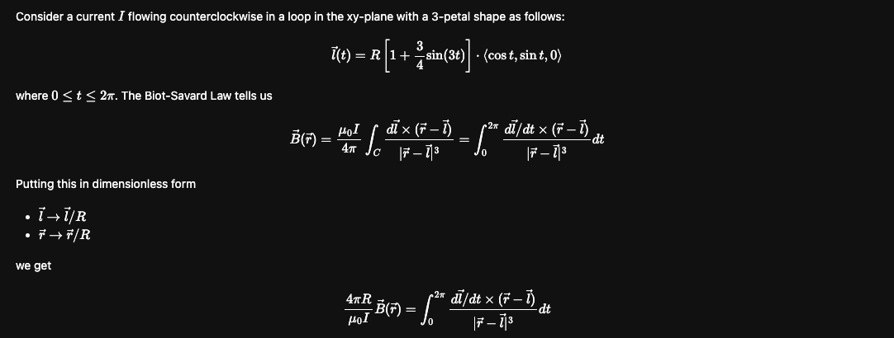

# Biot-Savart-Law
Create interactive Biot-Savart law representations.

---
This repository provides a solution for the magnetic field for current carrying wires of any shape or size based on the 
Biot-Savart law.



---
### Prerequisites

To run this code you must follow the steps below: 

#### Have Python3 and pip installed

- **Python3**
  - [Windows installation](https://www.python.org/downloads/windows/)
  - [Linux installation](https://www.python.org/downloads/source/)
- **Pip** 
  - [Windows installation](https://phoenixnap.com/kb/install-pip-windows)
  - [Linux installation](https://www.odoo.com/forum/help-1/how-to-install-pip-in-python-3-on-ubuntu-18-04-167715)

#### Install all libraries

- Run:
```
pip install -r requirements.txt 
```

---

### Running the Code

To run the program, you simply need to run:
```
python3 main.py
```

Upon running, the user will receive a few options: 
1. Create and save a 2d plot of the current density
2. Create and save a 3d plot of the magnetic field
3. Do both
4. Exit the program

Both plots are saved in the `plots/` directory.

The 3d plot is saved in `html` format, so you need to open it with a popular browser, like `Chrome`
